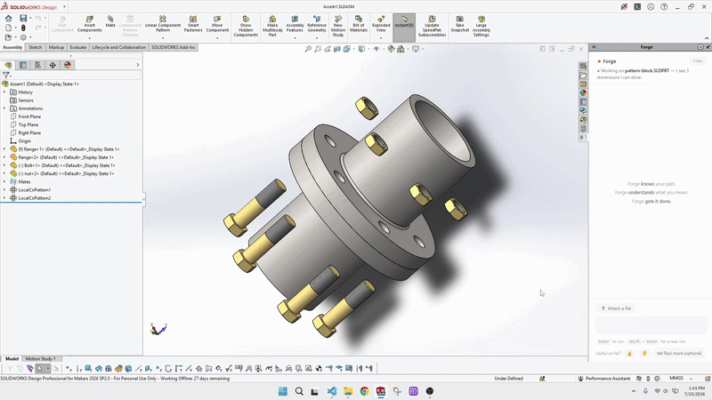
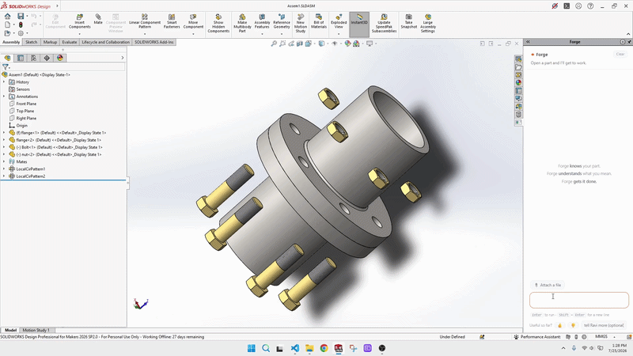
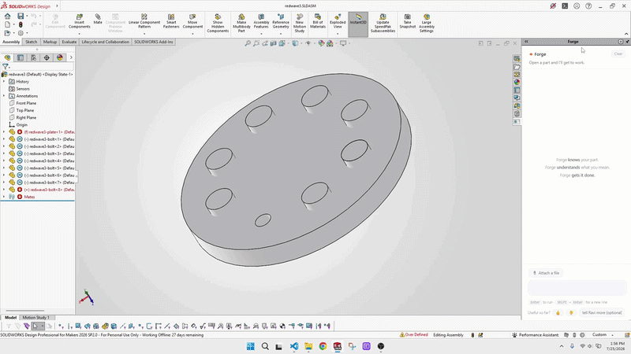
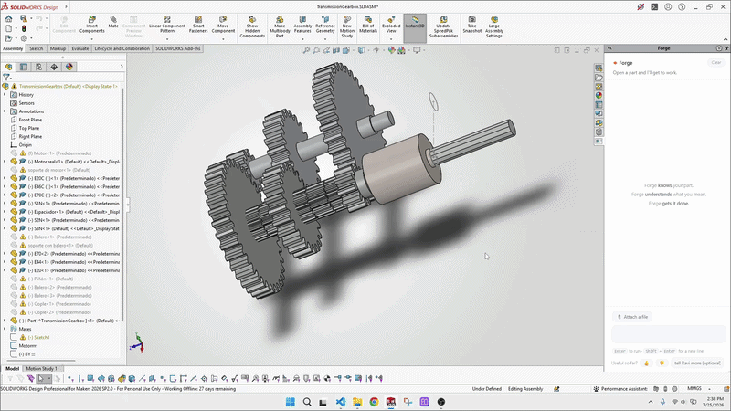

# Forge

[](https://github.com/kumar1441/forge_ai) [](https://discord.gg/xprNrjtaWx)

**Talk to SolidWorks. Get verified changes.** Forge is an open-source add-in that turns plain English into real parametric edits inside SolidWorks — and independently re-measures every change before it claims success.



```
"make the bore 25mm"          → sets the dimension, rebuilds, measures: 25.00mm ✓
"mate all the bolts"          → classifies fasteners, seats every mate, re-checks
"check interference"          → clash report, read-only
"color the flanges grey"      → applied, verified
"fillet all sharp edges 2mm"  → rounds found, applied, counted
```

283 tools across parts, assemblies, and drawings: dimensions, materials, colors, mates, patterns, shells, holes, equations, DXF export, health audits, and more.

**If Forge saves you an afternoon, star it — stars are how power users find it.**

## See it work

**Mirror everything except the hardware** — mirror the assembly across a plane; the exclusion list is previewed ("mirroring N of M, skipping K") before anything changes.



**Fix the red wave** — delta-debugging isolates the single over-defining or dangling mate, removes only it, and the rebuild goes clean.



**Explode it** — spread the assembly into a service view along its mate axes; view-only and fully reversible.



## Why Forge is different

- **It verifies, it doesn't bluff.** Every mutation is independently re-measured against the model (GroundTruth). If Forge can't do it, it says so — never a fake success.
- **Bring your own key.** Forge calls *your* LLM provider directly — Anthropic, OpenAI, DeepSeek, OpenRouter, or a local model via Ollama. Your key never leaves your machine (DPAPI-encrypted, current-user scope). No account, no subscription, no middleman.
- **Works with zero LLM.** A large part of the catalog routes through deterministic local parsing — free, offline, instant.

## Quickstart

1. **Prereqs:** Windows, SolidWorks 2022+, .NET Framework 4.8, Visual Studio 2022 (or Build Tools).
2. **Build:** `dotnet build solidworks/Forge.SolidWorks.csproj -c Release -p:Platform=x64`
3. **Install:** register the output DLL with `regasm /codebase` (admin), then enable Forge in SolidWorks → Tools → Add-ins.
4. **Configure a provider** (or skip — the keyless path needs no configuration): full steps in [docs/INSTALL.md](docs/INSTALL.md).

Signed one-command installer coming.

## Get a free key

**DeepSeek** — the cheapest route to try Forge; new accounts get usage credit.
1. Sign up at `platform.deepseek.com`, then **API Keys → Create** and copy the key.
2. In `config.json` set `provider` = `openai-compatible`, `baseUrl` = `https://api.deepseek.com/v1`, `model` = `deepseek-chat`.
3. Set the key: `setx FORGE_PROVIDER_KEY "sk-..."` (then restart SolidWorks).

**OpenRouter** — one key, every model (Claude, GPT, Llama, DeepSeek…).
1. Sign up at `openrouter.ai`, then **Keys → Create** and copy the key.
2. In `config.json` set `provider` = `openai-compatible`, `baseUrl` = `https://openrouter.ai/api/v1`, `model` = the model id of your choice.
3. Set the key: `setx FORGE_PROVIDER_KEY "sk-or-..."` (then restart SolidWorks).

**Ollama** — fully local, free, no key, no account.
1. Install from `ollama.com`, then `ollama pull <model>` (e.g. `llama3.2`).
2. In `config.json` set `provider` = `openai-compatible`, `baseUrl` = `http://localhost:11434/v1`, `model` = the model name you pulled.
3. No key needed — leave `FORGE_PROVIDER_KEY` unset.

## Community

Join the Forge Discord — install help, demo requests, and feature votes: **https://discord.gg/xprNrjtaWx**

## Telemetry

Forge telemetry is on by default and sends anonymous usage statistics only — hashes, never geometry, file names, or anything identifying. Turn it off any time in Settings; with it off, nothing leaves your machine.

## Support Forge

Forge is free, open source, and built one afternoon at a time. If it saves you one, **star the repo** — stars are how power users find it. Know a fellow engineer fighting SolidWorks? Send them this page. Found a bug or want a command? Open an [issue](https://github.com/kumar1441/forge_ai/issues) — report a bug or request a command using the issue templates.

## Contributing

PRs welcome — one new command is one spec row + one handler + one test; see [CONTRIBUTING.md](CONTRIBUTING.md) and the roadmap on [GitHub Issues](https://github.com/kumar1441/forge_ai/issues).

## License

MIT — see [LICENSE](LICENSE). Built by Ravi — made with love for the CAD community.
